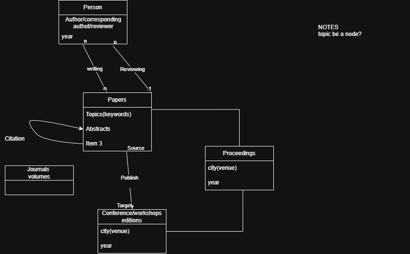

SMD_UPC — Semantic Data Management @ UPC
> Hands-on lab coursework for the **Semantic Data Management** course at Universitat Politècnica de Catalunya (UPC).
---
🗂️ Repository Structure
```
LAB1_Author1surnameAuthor2surname.zip
├── LAB1_Author1surnameAuthor2surname.pdf
│   (PDF report with schema images for A.1 and A.3, and explanations for all exercises. Include detailed decision-making within the 8-page limit.)
├── A/
│   ├── A.1/
│   │   └── Schema.png
│   │       (Image of the schema, must be included in the report, a copy here is optional)
│   ├── A.2/
│   │   ├── FormatCSV.py
│   │   │   (Script to generate CSV files detailing nodes and edges)
│   │   └── UploadCSV.py
│   │       (Script to populate the Neo4J database using the CSV files)
│   └── A.3/
│       ├── Schema.png
│       │   (Image of the updated schema, must be included in the report, a copy here is optional)
│       ├── FormatUpdateCSV.py
│       │   (Script to generate CSV files with new nodes and edges)
│       └── UploadUpdateCSV.py
│           (Script to populate the Neo4J database with new elements)
├── B/ (Scripts executing the queries)
│   ├── B1.py
│   ├── B2.py
│   ├── B3.py
│   └── B4.py
├── C/ (Scripts executing queries and updates)
│   ├── C1.py
│   ├── C2.py
│   ├── C3.py
│   └── C4.py
└── D/ (Scripts executing the algorithms)
    ├── D1.py
    └── D2.py
```
---
The property graph models an academic publishing ecosystem, capturing papers, authors, venues, keywords, and institutions along with their relationships.
> **Schema diagram:**

